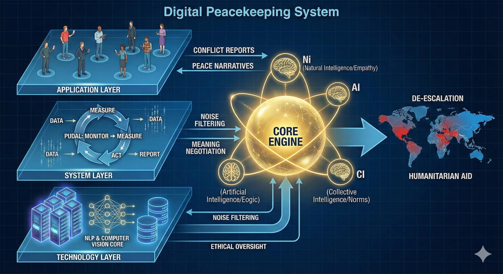

# My Concepts: Harmoni AI-Sentris

## 1. Filosofi dan Arsitektur Sistem (TISE Framework)

Konsep ini tidak dibangun sebagai aplikasi tunggal, melainkan sebuah **"Kendaraan Rekayasa"** yang dirancang secara sistematis melalui tiga lapisan fundamental Arsitektur TISE (*Technological & Information System Engineering*):

### a. Lapisan Aplikasi (Empowering Stakeholders)
Kita mengubah paradigma masyarakat dari sekadar "objek perang" menjadi **"Protagonis-Penulis"** dari narasi perdamaian mereka sendiri. Melalui platform komunikasi publik yang terdesentralisasi, 8 miliar manusia dapat melaporkan kondisi *real-time*, memvalidasi informasi, dan membangun komunitas lintas batas yang menolak narasi kebencian secara kolektif.

### b. Lapisan Sistem (The Vehicle of Peace)
Sistem ini berfungsi sebagai "Kendaraan" yang secara otomatis menjalankan siklus **PUDAL** (Pantau, Ukur, Diagnosis, Aksi, Lapor):
* **Pantau & Ukur:** Mendeteksi anomali komunikasi dan eskalasi retorika perang di media digital.
* **Diagnosis:** Membedakan aspirasi politik sah dengan disinformasi pemicu kekerasan.
* **Aksi:** Meluncurkan "Repertoar Komunikasi"—persediaan narasi damai dan bantuan logistik darurat.

### c. Lapisan Teknologi & Fundamental (The Core Engine)
Mengembangkan instrumen *Natural Language Processing* (NLP) canggih untuk **"Negosiasi Makna"** lintas budaya. Mesin ini memahami nuansa bahasa dan emosi untuk menerjemahkan pesan antar-pihak bertikai tanpa distorsi "kebisingan" (*noise*) yang memicu salah paham fatal.

## 2. Logika Kekuatan Rekayasa ($K > B$)

Keberhasilan de-eskalasi konflik bergantung pada hukum kesetimbangan tenaga:
* **Beban Masalah [B]:** Konflik dan perang yang memengaruhi ~2 miliar jiwa (25% populasi global) dan 122,6 juta pengungsi.
* **Kekuatan Rekayasa [K]:** Sinergi sistem informasi global, pemrosesan data masif AI, dan empati kolektif manusia.
* **Logika:** Dengan menghimpun kekuatan teknologi cerdas yang melampaui beban masalahnya ($K > B$), sistem ini mampu mengangkat derajat kemanusiaan dari kehancuran fisik menuju stabilitas komunikasi.

## 3. Otak Sistem: Sinkronisasi Kecerdasan Triune

Sistem ini dikendalikan oleh tiga pilar kecerdasan yang saling mengawasi untuk mencegah politisasi:
1.  **Ni (Natural Intelligence):** Empati dan kebijakan manusia (ahli resolusi konflik) untuk memastikan teknologi tetap manusiawi.
2.  **AI (Artificial Intelligence):** "Juru Tulis Cerdas" untuk penalaran logis, pemetaan logistik pengungsi, dan analisis data objektif.
3.  **CI (Collective Intelligence):** Norma sosial dan validasi komunitas global sebagai "Superego" digital untuk menyaring bias politik.

## 4. Mesin Inti: Pengelolaan Energi Kemanusiaan

Operasional sistem ditenagai oleh pengelolaan energi 8 miliar manusia (*Human Energon*) secara holistik melalui **CORE Engine**:
* **AQ (Hati):** Ketahanan mental masyarakat menghadapi krisis.
* **PI-A (Pikiran):** Penalaran logis AI mencari solusi teknis de-eskalasi.
* **PSKVE (Tenaga):** Memastikan solusi menyediakan Produk, Layanan, Pengetahuan, dan Nilai yang berkelanjutan bagi korban konflik.

## 5. Esensi: Self-Fulfilling Prophecy

Tujuan akhir sistem adalah menciptakan **"Self-Fulfilling Prophecy"** (Ramalan yang Memenuhi Diri Sendiri) yang positif. Dengan memvisualisasikan data perdamaian yang transparan, kita mengubah **Prospek** (prediksi masa depan) masyarakat dari ketakutan menjadi harapan, sehingga menggerakkan aksi komunikasi