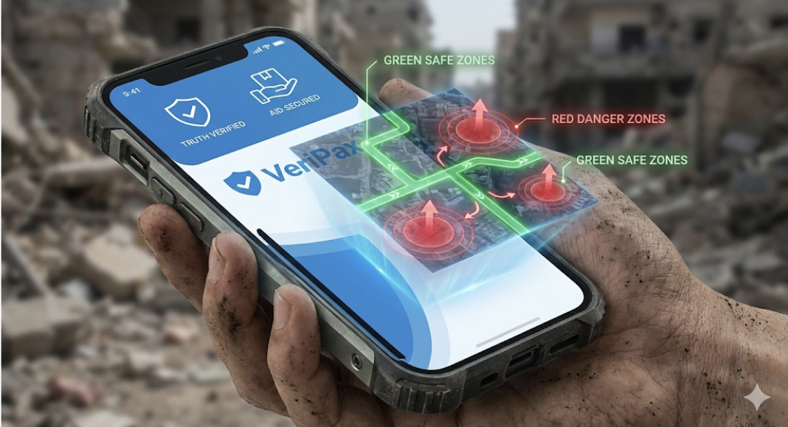
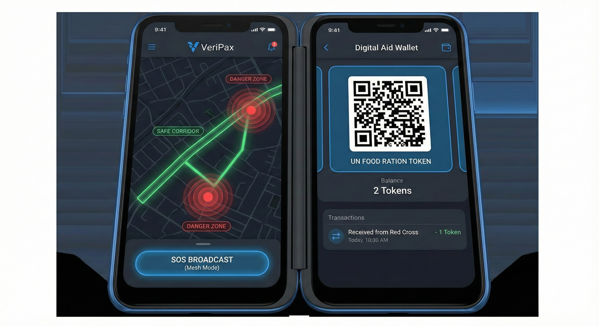
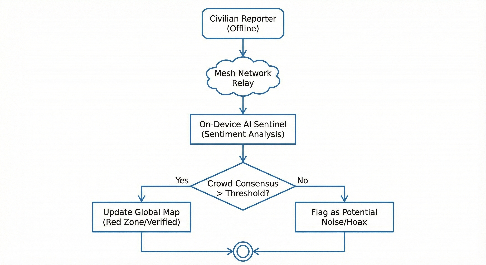
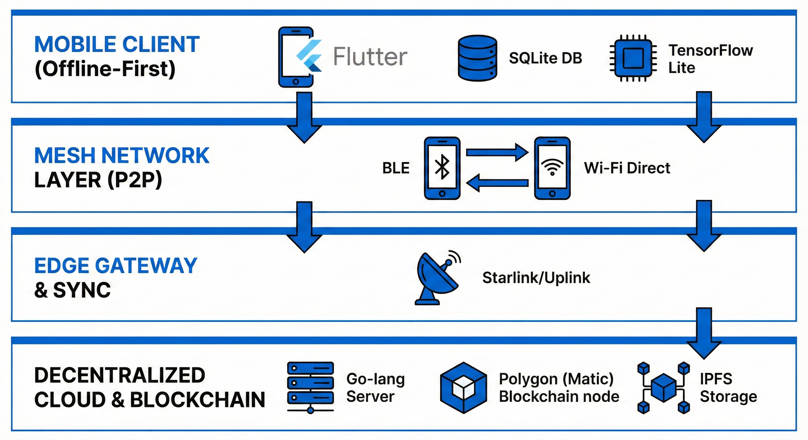

# My Innovations: VeriPax Protocol

**Decentralized Truth & Safety Protocol untuk Zona Konflik**



## 1. Pengantar: From Abstract Shield to Concrete App

Di UAS-1, saya membangun konsep *Digital Peacekeeping* dengan arsitektur TISE. Di UAS-2, saya berargumen bahwa AI harus menjadi "Perisai Digital" yang dikendalikan oleh empati manusia.
Sekarang di UAS-3, saya menghadirkan **VeriPax** — implementasi konkret dari perisai tersebut.

VeriPax bukan sekadar aplikasi chat; ini adalah *survival ecosystem* berbasis Blockchain dan AI yang dirancang untuk beroperasi di lingkungan di mana kepercayaan telah runtuh dan infrastruktur hancur.

**Core Mission:** Memberikan hak atas kebenaran dan keselamatan bagi warga sipil melalui teknologi yang tidak bisa disensor atau dimatikan (unstoppable).

## 2. Platform Overview

### 2.1 Value Proposition

* **For Civilians (The Victims):** "Waze untuk Zona Perang. Tahu rute evakuasi aman secara real-time, hindari area serangan, dan dapatkan bantuan logistik tanpa perantara korup."
* **For NGOs/Humanitarian (The Helpers):** "Distribusi bantuan yang transparan. Pastikan logistik sampai ke tangan pengungsi yang valid, bukan dicuri milisi, menggunakan Smart Contracts."
* **For Journalists (The Witnesses):** "Verifikasi fakta instan. Dapatkan data lapangan yang sudah divalidasi oleh konsensus algoritma, bukan propaganda."



## 3. Key Features & Mechanics

### 3.1 Feature 1: Consensus-Based Truth Mapping
**What:** Sistem pemetaan bahaya real-time yang tidak bergantung pada satu sumber, melainkan konsensus massa (*Crowd-Validation*) yang diverifikasi AI.

**How It Works (Algorithm Logic):**
Berbeda dengan media sosial biasa, VeriPax menggunakan *Trust Score* untuk memvalidasi laporan bahaya.



```python
# Simplified Logic untuk Verifikasi Laporan Bahaya
def verify_danger_report(report, location_radius):
    # 1. Ambil laporan serupa di radius yang sama dalam 10 menit terakhir
    nearby_reports = get_reports(report.location, time_window=10mins)
    
    confirmations = 0
    total_trust_score = 0
    
    for r in nearby_reports:
        # User dengan history akurat punya bobot nilai lebih tinggi (Reputation System)
        user_weight = get_user_trust_score(r.user_id) 
        confirmations += 1
        total_trust_score += user_weight

    # 2. Ambang Batas Verifikasi (Consensus Threshold)
    # Jika Trust Score > 75, tandai sebagai "Verified Danger" (Merah)
    if total_trust_score > 75:
        update_map_status(report.location, status="RED_ZONE")
        broadcast_alert(report.location, "Confirmed Attack")
        
    # Jika Trust Score 20-75, tandai sebagai "Unverified Warning" (Kuning)
    elif total_trust_score > 20:
        update_map_status(report.location, status="YELLOW_ZONE")
        
    # AI Sentiment Analysis untuk filter Hoax/Bot/Provokasi
    else:
        ai_check = run_nlp_analysis(report.text)
        if ai_check == "PROVOCATION":
            flag_user(report.user_id, reason="Potential Hoax")

### 3.2 Feature 2: Offline Mesh Networking (P2P)

**What:** Infrastruktur komunikasi darurat yang tetap berfungsi meskipun internet mati total atau menara seluler hancur.

**Technical Implementation:**
Menggunakan protokol *Peer-to-Peer* (P2P) dengan teknologi Bluetooth Low Energy (BLE) dan Wi-Fi Direct. Setiap perangkat pengguna berfungsi sebagai *node* (repeater) untuk meneruskan pesan terenkripsi ke perangkat lain di sekitarnya hingga mencapai *node* yang memiliki koneksi internet (disebut *Edge Gateway*).

**Scenario Flow:**
1.  **User A** (di bunker tanpa sinyal) mengirim pesan SOS/Laporan Bahaya.
2.  Pesan dienkripsi dan "melompat" (*hop*) ke **User B** (jarak 50m) $\rightarrow$ **User C** (jarak 100m).
3.  **User D** (di perbatasan yang memiliki sinyal satelit/internet) menerima paket data tersebut secara *background*.
4.  Aplikasi di HP User D otomatis mengunggah pesan User A ke server pusat VeriPax tanpa intervensi manual.

### 3.3 Feature 3: Smart-Aid Distribution

**What:** Distribusi bantuan logistik yang transparan dan anti-korupsi menggunakan *Smart Contracts*.

**Problem:** Bantuan konvensional sering dicuri atau ditimbun oleh oknum perantara sebelum sampai ke pengungsi.

**Solution Flow:**
1.  **Tokenization:** Donor mengirim dana yang dikonversi menjadi token digital (misal: 1 TokenPax = 1 Paket Sembako).
2.  **Claim:** Pengungsi menerima Token QR di aplikasi VeriPax yang terikat dengan ID Biometrik mereka (tidak bisa dipindah tangankan).
3.  **Redemption:** Merchant atau POS NGO memindai QR code pengungsi.
4.  **Settlement:** *Smart Contract* otomatis memverifikasi transaksi dan mencairkan dana (Stablecoin) ke dompet digital Merchant saat itu juga.
5.  **Tracking:** Donor dapat melacak secara *real-time*: "Bantuan saya $50 telah ditukar menjadi beras oleh Keluarga X di Kamp Y pada jam 14:00."

## 4. Technical Architecture

### 4.1 Technology Stack (Student-Feasible)

[cite_start]Kami menggunakan *tech stack* modern, *open-source*, dan hemat biaya yang memungkinkan untuk dikembangkan oleh tim mahasiswa [cite: 250-254].



* **Frontend (Mobile):** **Flutter**
    * *Alasan:* *Single codebase* untuk Android (dominan di negara berkembang) dan iOS. Performa mendekati *native*.
* **Backend:** **Go-lang (Go)**
    * *Alasan:* Konkurensi tinggi untuk menangani ribuan pesan *mesh* real-time dengan penggunaan memori rendah.
* **Blockchain Layer:** **Polygon (Matic)**
    * *Alasan:* Kompatibel dengan Ethereum (EVM), transaksi sangat cepat (<2 detik), dan *gas fee* nyaris nol ($<0.01), sangat krusial untuk bantuan mikro.
* **On-Device AI:** **TensorFlow Lite**
    * *Alasan:* Menjalankan model NLP dan sentimen analisis langsung di HP pengguna tanpa perlu internet, menjaga privasi dan kecepatan.
* **Database:**
    * **Local:** SQLite (untuk penyimpanan data *offline* di HP).
    * [cite_start]**Cloud:** MongoDB (untuk data peta/laporan yang sudah disinkronisasi)[cite: 252].

### 4.2 Offline-First Architecture Principle

[cite_start]Aplikasi dibangun dengan filosofi **"Local-First"** [cite: 93-96]:
1.  **Write Locally:** Semua input (chat, laporan, transaksi) ditulis ke database lokal HP terlebih dahulu. UI langsung merespons "Sent" agar UX lancar.
2.  **Queue & Sync:** *Service worker* di latar belakang terus memantau konektivitas. Begitu ada koneksi (Mesh atau Internet), antrian data (*queue*) disinkronisasi ke server/node lain.
3.  **Conflict Resolution:** Menggunakan algoritma *CRDT (Conflict-free Replicated Data Types)* untuk menggabungkan data dari banyak user yang *offline* tanpa bentrokan data.

## 5. Business Model & Sustainability

[cite_start]VeriPax bukan aplikasi komersial B2C, melainkan menggunakan model **B2O (Business to Organization)** dan **B2G (Business to Government)** untuk memastikan keberlanjutan tanpa membebani korban perang [cite: 255-260].

### 5.1 Revenue Streams

1.  **SaaS Dashboard for NGOs ($500 - $2000/bulan):**
    Organisasi besar (Red Cross, UNHCR, UNICEF) berlangganan akses "Command Center Dashboard". [cite_start]Mereka mendapatkan peta panas (*heatmaps*) kebutuhan logistik, pergerakan pengungsi, dan area bahaya secara analitik untuk perencanaan misi kemanusiaan yang lebih efektif[cite: 260].
2.  **Transaction Fee (0.5%):**
    Potongan biaya transaksi yang sangat kecil dari volume distribusi bantuan via *Smart Contract* untuk menutup biaya operasional server dan *gas fee* blockchain.
3.  **CSR & Grants:**
    Pendanaan dari program CSR perusahaan teknologi dan hibah inovasi kemanusiaan (misal: Gates Foundation, UNICEF Innovation Fund).

### 5.2 Cost Structure (Estimasi Tahun Pertama)

* [cite_start]**Infrastruktur Cloud (AWS/GCP):** Rp 15 Juta/bulan (Skala awal 50.000 user)[cite: 263].
* **API Peta (Mapbox/Google Maps):** Rp 5 Juta/bulan.
* **Blockchain Operational:** Rp 2 Juta/bulan.
* **Pengembangan SDM:** Berbasis komunitas *Open Source* dan program Magang/Skripsi Mahasiswa.

## 6. Impact Measurement & Roadmap

### 6.1 Key Performance Indicators (KPI)

[cite_start]Keberhasilan VeriPax diukur dari dampak kemanusiaan nyata [cite: 268-272]:
1.  **Verified Lives Saved:** Jumlah pengguna yang berhasil mencapai Zona Aman menggunakan navigasi VeriPax.
2.  **Misinformation Blocked:** Jumlah/Persentase laporan palsu (hoax) yang berhasil dicegat oleh filter AI dan konsensus komunitas.
3.  **Aid Efficiency Rate:** Peningkatan kecepatan dan ketepatan distribusi bantuan dibandingkan metode manual/kupon fisik.

### 6.2 Implementation Roadmap

* **Phase 1: Alpha (Bulan 1-3):** Pengembangan prototipe MVP. Uji coba fitur *Mesh Networking* di lingkungan kampus dengan simulasi pemadaman internet.
* **Phase 2: Beta Pilot (Bulan 4-6):** Kemitraan dengan NGO lokal di satu kamp pengungsian spesifik (misal: Pengungsi bencana alam di Indonesia). [cite_start]Fokus pada fitur distribusi bantuan[cite: 273].
* **Phase 3: Global Release (Tahun 1+):** Rilis kode sebagai *Open Source Public Goods*. Adopsi oleh organisasi kemanusiaan internasional untuk zona konflik aktif (Timur Tengah, Eropa Timur, Afrika).

## 7. Conclusion

VeriPax adalah manifestasi dari keyakinan bahwa **teknologi harus berpihak**. Di tengah dehumanisasi akibat perang, VeriPax hadir sebagai infrastruktur digital yang mengembalikan agensi dan martabat kepada warga sipil.

Kami tidak bisa menghentikan peluru, namun dengan kode dan algoritma, kami bisa membantu ribuan orang menghindarinya. Ini adalah **Rekayasa untuk Kemanusiaan**.

**"In a world of weaponized information, truth is the ultimate shield."**