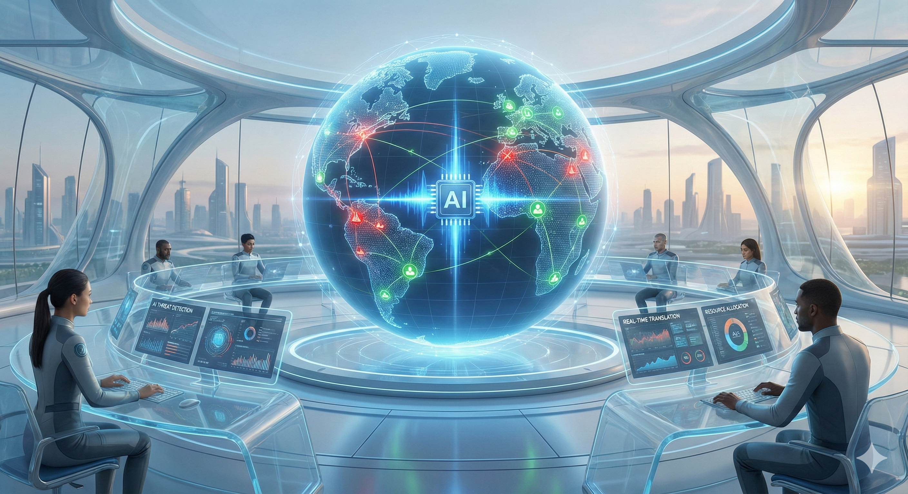

# My Opinions: Etika AI dalam Konflik Global

## 1. Posisi Utama: AI sebagai Perpanjangan Tangan, Bukan Penentu Nasib

Dalam menghadapi krisis kemanusiaan yang melibatkan sekitar **[2 miliar orang](top10.pdf)** atau seperempat penduduk dunia di wilayah konflik, saya berpendirian teguh bahwa **Artificial Intelligence (AI) tidak boleh diberikan otonomi penuh** dalam pengambilan keputusan hidup dan mati.

AI harus diposisikan secara mutlak sebagai **["Perisai Digital"](materi_KOMINTER.pdf)** (instrumen pendukung) yang memperkuat kapasitas manusia untuk mendeteksi disinformasi dan memfasilitasi perdamaian, bukan sebagai **"Pedang"** (senjata otonom). Di era ini, kehebatan rekayasa sistem informasi bukan diukur dari seberapa efisien mesin menghancurkan, melainkan seberapa cerdik kita menggunakannya untuk mencegah kehancuran melalui "Negosiasi Makna" yang tepat.

## 2. Argumen I: Ketiadaan "Hati" dan Jurang Akuntabilitas

Argumen fundamental saya berfokus pada keterbatasan mesin dibandingkan manusia:

* **Ketiadaan Ni (*Natural Intelligence*):** AI mampu memproses data masif, namun ia tidak memiliki empati atau kesadaran situasional yang dimiliki manusia. Dalam perang, keputusan sering kali berada di wilayah "abu-abu" moral yang membutuhkan kebijakan nurani.
* **Beban Tanpa Perasaan:** Mesin tidak bisa merasakan **[Beban Masalah](top10.pdf)** yang nyata. Jika kita membiarkan AI menentukan target serangan, kita sedang mendelegasikan tanggung jawab moral kemanusiaan kepada sebuah skrip kode yang tidak memiliki ketahanan hati untuk merasakan penderitaan korban.

## 3. Argumen II: Mencegah Eskalasi Konflik Akibat "Kebisingan"

Konflik dan perang sering kali dipicu oleh perubahan **"Prospek"** atau prediksi masa depan yang negatif.

* **Disinformasi sebagai Pemicu:** Di era digital, narasi kebencian dapat menyebar cepat dan menjadi "kebisingan" (*noise*) yang memicu aksi komunikasi destruktif.
* **AI sebagai Filter Perdamaian:** Alih-alih digunakan untuk menyerang, AI harus dikembangkan untuk menyaring *noise* tersebut dan menyediakan **"Repertoar Komunikasi"**—yaitu persediaan narasi damai dan jalan keluar logis bagi pihak yang bertikai.

## 4. Argumen III: Kolektivitas Melawan Politisasi

Kekhawatiran akan politisasi teknologi dapat dimitigasi dengan melibatkan kekuatan sosial yang lebih luas:

* **[Collective Intelligence](materi_KOMINTER.pdf) sebagai Superego:** Sistem AI dalam pertahanan harus diawasi oleh norma sosial dan pengetahuan bersama dari komunitas global sebagai filter moral.
* **Pemberdayaan "Protagonis-Penulis":** Kita harus mendorong sistem informasi yang transparan, di mana **8 miliar manusia** dapat menjadi subjek yang memvalidasi kebenaran. Dengan menerapkan siklus **[PUDAL](Materi%20KOMINTER.pdf)** (Pantau, Ukur, Diagnosis, Aksi, Lapor) yang dapat diakses publik, kita mencegah teknologi menjadi alat bagi kepentingan politik sempit.

## 5. Kesimpulan: Menuju Kemufakatan Global

Tujuan akhir dari komunikasi interpersonal adalah mendapatkan **[pengertian, persetujuan, dan kemufakatan](materi_KOMINTER.pdf)**. Teknologi AI harus diarahkan untuk membantu manusia mencapai tujuan luhur ini di tengah krisis.

Kita memerlukan regulasi internasional yang menjamin adanya protokol **"Human-in-the-loop"** (manusia dalam kendali). AI adalah pengganda kekuatan (*force multiplier*), namun empati manusia adalah kompas moralnya. Jangan sampai kita menciptakan mesin yang bisa "berpikir" namun kehilangan kemampuan untuk "merasa".